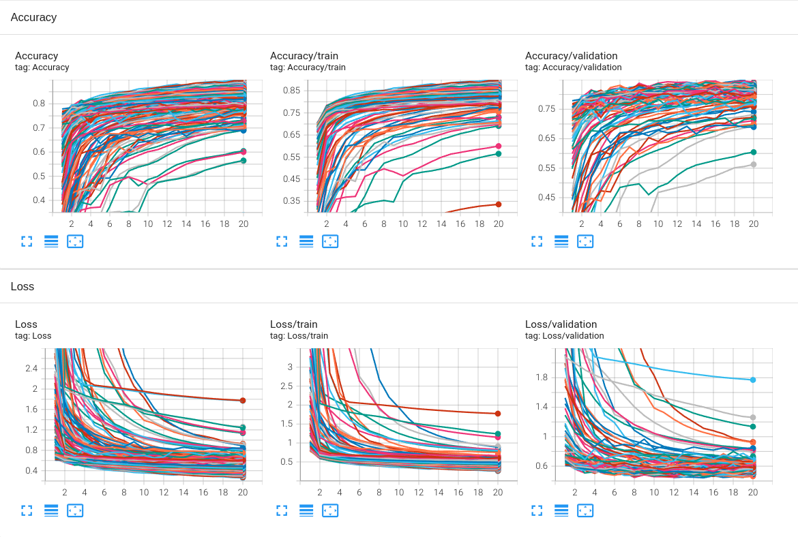
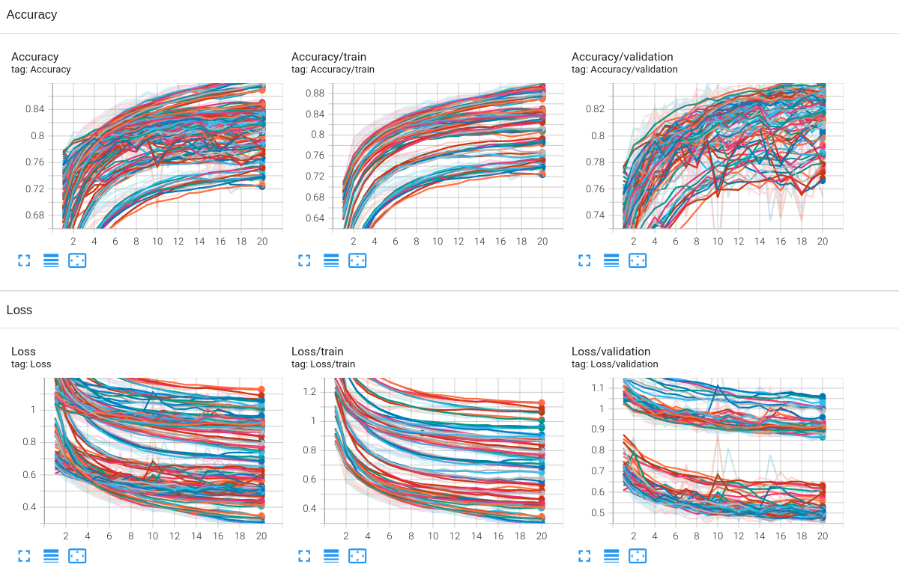
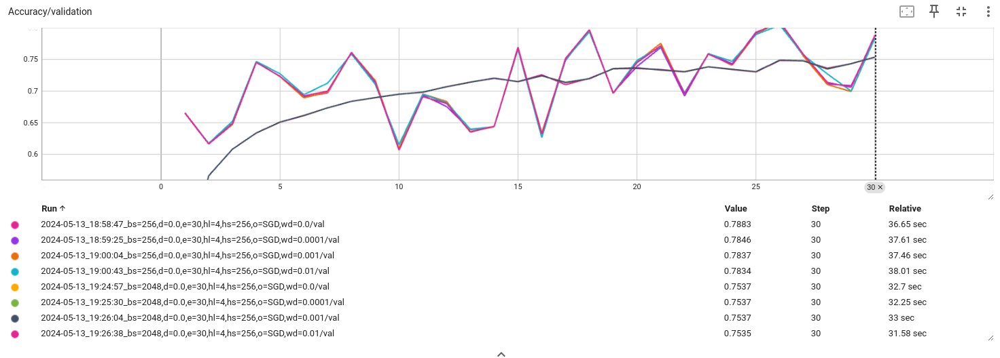
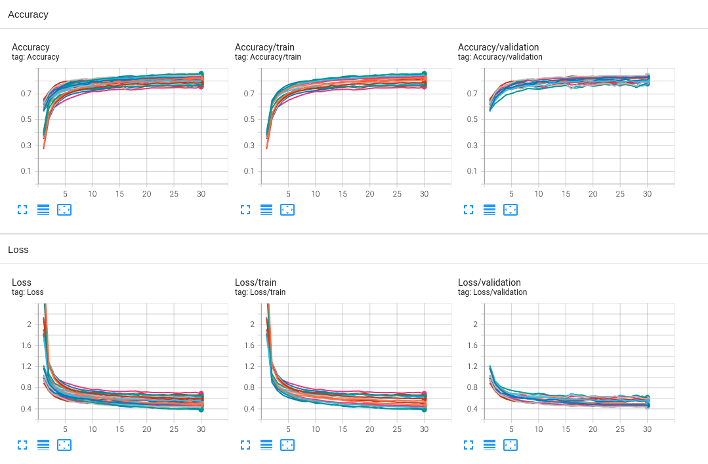
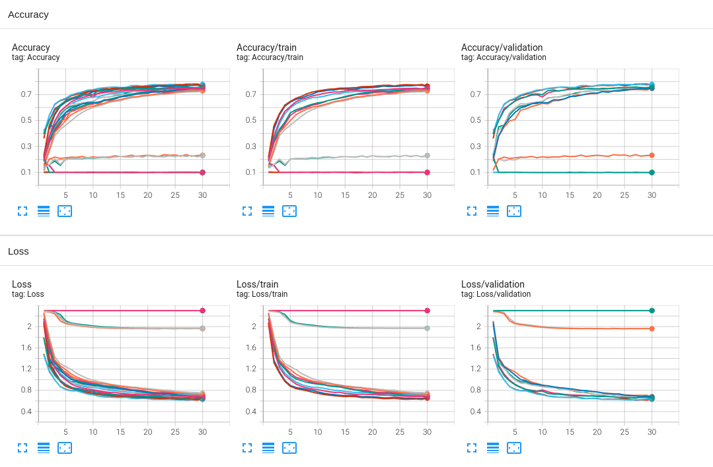
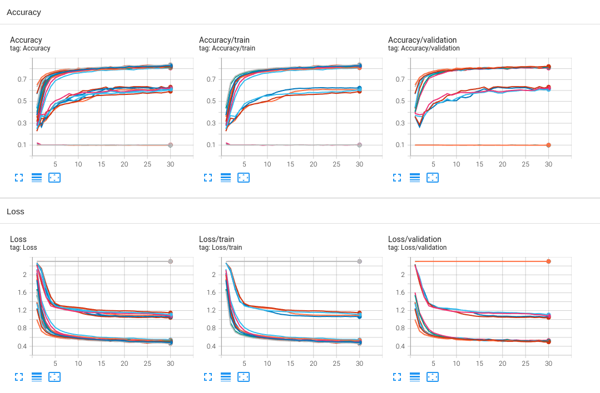
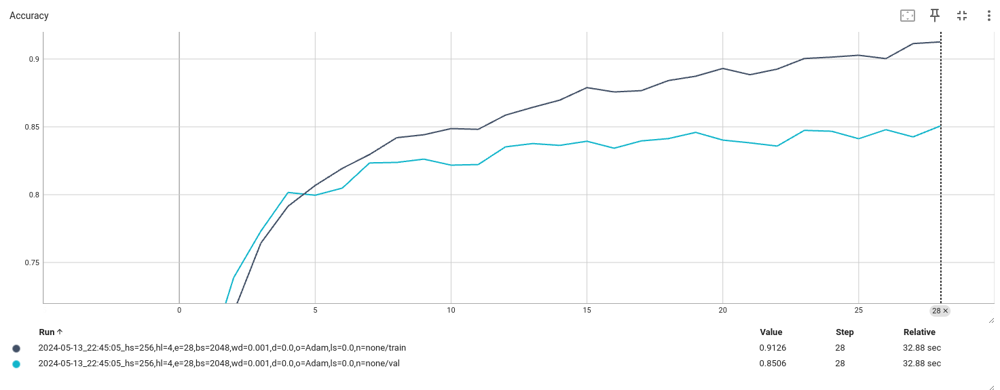

**Assignment #2 - Use of Neural Networks**

The notebook focuses on constructing suitable neural network models for multi-class classification of images derived from the Fashion MNIST dataset. The primary objectives are to explore data, build and train feed-forward neural networks (FFNN), experiment with various hyperparameters and regularization techniques, and select the best-performing model to predict labels on new data.

---

### **Data Exploration**

- **Data Source**: The dataset consists of grayscale images of size 32x32 pixels, loaded from `train.csv`.
- **Classes**: There are 10 categories representing different fashion items:
    - **0**: T-shirt/top
    - **1**: Trouser
    - **2**: Pullover
    - **3**: Dress
    - **4**: Coat:
    - **5**: Sandal
    - **6**: Shirt
    - **7**: Sneaker
    - **8**: Bag
    - **9**: Ankle boot

- **Data Splitting**: The data is split into training and validation sets with a 60/40 split.
- **Visualization**:
    - Displayed random samples of images along with their pixel value histograms.
        - Example images for each class were visualized to understand the data distribution.
    - **Class Distribution**: Verified that classes are uniformly distributed, eliminating concerns about class imbalance.

---

### **Feed-Forward Neural Network (FFNN)**

#### **Preparations**

- **Data Conversion**:
    - Converted image data to PyTorch tensors and created datasets for training and validation.
    - Ensured data types are compatible with PyTorch models (e.g., converting pixel values to `float32`).

- **Model Definition**:
    - Implemented a `NeuralNetwork` class using PyTorch's `nn.Module`.
    - The network architecture includes:
        - Input layer with 1,024 neurons (for 32x32 pixel images flattened).
        - Variable number of hidden layers and units (hyperparameters).
        - Output layer with 10 neurons (for 10 classes).
        - ReLU activation functions after each hidden layer.
        - Optional dropout layers for regularization.

- **Training Infrastructure**:
    - Defined functions for training epochs, validation, optimizer setup, and training loops.
    - Implemented logging mechanisms using TensorBoard and custom CSV exporters for tracking hyperparameters and metrics.
    - Used functions to handle hyperparameter parsing and result aggregation.

#### **Hyperparameter Tuning**

- **Initial Experiments**:
    - Explored various combinations of:
        - **Hidden Layer Sizes**: 32, 64, 128, 256 units.
        - **Number of Hidden Layers**: 1 to 4 layers.
        - **Batch Sizes**: 32, 128, 512, 2,048, 8,192.
        - **Epochs**: Fixed at 20 for initial experiments.
    - Used `ParameterGrid` to systematically explore the hyperparameter space.
    - Trained multiple models and logged results for analysis.

- **Analysis**:
    - **Visualization**: Employed TensorBoard to visualize training and validation loss and accuracy.
        - Example TensorBoard visualization:
            
    - **Findings**:
        - Increasing hidden layer size and depth generally improved performance up to a point.
        - Models with 3-4 hidden layers and 128-256 units performed better.
        - Smaller batch sizes (32 - 512) tended to yield better generalization.
        - Validation accuracy plateaued around 20 epochs.

#### **Regularization Techniques**

- **Techniques Explored**:
    - **Dropout**: Tested dropout rates of 0.0, 0.1, and 0.3 to prevent overfitting.
    - **Weight Decay**: Applied L2 regularization with weight decay values of 0.0, 1e-4, and 1e-2.
    - **Label Smoothing**: Used label smoothing values of 0.0 and 0.1 to reduce overconfidence in predictions.

- **Findings**:
    - **Dropout and Weight Decay**:
        - Did not significantly improve validation loss or accuracy.
        - Best models often had minimal or no dropout and weight decay.
    - **Label Smoothing**:
        - A label smoothing value of 0.1 negatively impacted performance.
        - Validation loss increased, and accuracy decreased, indicating over-regularization.
    - **Best Validation Metrics**:
        - Validation loss around 0.445.
        - Validation accuracy approximately 83.8%.

- **Visualization**:
  - Validation loss and accuracy with regularization:
    

#### **Optimizer Experiments**

- **Optimizers Tested**:
    - **Adam**: Adaptive learning rate optimizer.
    - **SGD**: Stochastic Gradient Descent.

- **Results**:
    - **Adam**:
        - Consistently outperformed SGD.
        - Provided smoother convergence and better final accuracy.
    - **SGD**:
        - Showed spiky training behavior, especially with smaller batch sizes.
        - Example of SGD training spikes:
          
        - Less effective in navigating the optimization landscape compared to Adam.

#### **Normalization and Standardization**

- **Approach**:
    - Tested data preprocessing methods:
        - **No Normalization**: Raw pixel values.
        - **Min-Max Normalization**: Scaling features to a range of [0, 1].
        - **Standardization**: Scaling features to zero mean and unit variance.

- **Findings**:
    - **Normalization Impact**:
        - Both normalization and standardization negatively affected model performance.
        - Validation loss increased, and accuracy decreased with scaling.
    - **Possible Reasons**:
        - Interaction with weight decay and ReLU activation functions.
        - Scaling may have disrupted the data distribution that the network had effectively learned from in its raw form.
    - **Visualization**:
      - Performance without normalization:
        
      - Performance with Min-Max normalization:
        
      - Performance with standardization:
        

---

### **Convolutional Neural Network (CNN)**

- **Note**: While the notebook acknowledges that CNNs are more suitable for image data due to their ability to capture spatial hierarchies, the primary focus remained on feed-forward neural networks. CNN implementation was not detailed in the notebook.

---

### **Final Model Selection and Evaluation**

#### **Best Model Hyperparameters**

- **Parameters**:
    - `hidden_size`: **256**
    - `hidden_layers`: **4**
    - `epochs`: **28**
    - `batch_size`: **2,048**
    - `weight_decay`: **1e-3**
    - `dropout`: **0.0**
    - `optimizer`: **'Adam'**
    - `label_smoothing`: **0.0**
    - `normalization`: **'none'**

#### **Training and Performance**

- **Training**:
    - Retrained the final model using the best hyperparameters on the combined training data.
    - Used a larger number of epochs to ensure convergence.
    - Disabled output during training for brevity.

- **Validation Results**:
    - Achieved a validation accuracy of approximately **85%**.
    - Validation loss and accuracy curves indicated stable training without overfitting.
    - Final model training visualization:
      

- **Expected Test Performance**:
    - Based on validation results and cross-validation, expected test accuracy is around **83%**.

#### **Prediction on Evaluation Data**

- **Data Loading**:
    - Loaded evaluation data from `evaluate.csv`.
    - Preprocessed data consistently with training data (no normalization).

- **Prediction Process**:
    - Converted evaluation images to tensors.
    - Set the model to evaluation mode (`model.train(False)`).
    - Used the model to predict class probabilities and determined the predicted class labels.
    - Ensured reproducibility by setting the random seed.

- **Results Saving**:
    - Created a DataFrame with `ID` and `label` columns.
    - Saved predictions to `results.csv`.

---

### **File Structure**

The project directory is organized as follows (excluding concrete logs):

```
.
├── evaluate.csv
├── homework_02_B232.ipynb
├── images
│   ├── depth_size_exp
│   │   ├── all_rd_42.png
│   │   ├── best_model_acc.png
│   │   └── best_model_loss.png
│   ├── evaluation
│   │   └── best_model.png
│   ├── ffnn_normalization
│   │   ├── all_minmax.png
│   │   ├── all_none.png
│   │   ├── all_standardization.png
│   │   └── weight_decay_test
│   │       ├── all_no_wd.png
│   │       └── all_wd_0.1.png
│   ├── ffnn_optimizers
│   │   ├── all_adam.png
│   │   ├── all.png
│   │   ├── all_sgd.png
│   │   └── SGD_spikes.png
│   ├── ffnn_regularization
│   │   ├── all.png
│   │   ├── best_model_acc.png
│   │   └── best_model_loss.png
│   └── parameter_space_spikes.png
├── logs
│   ├── archive
│   ├── depth_and_size_experimentation
│   ├── ffnn_normalization
│   │   └── weight_decay_test
│   ├── ffnn_optimizers
│   ├── ffnn_regularization
│   ├── final
│   ├── results.csv
│   └── test
├── README.md
├── results.csv
├── train.csv
└── utils
    └── svg_to_png.py

18 directories, 24 files

```

- **images/**: Contains visualizations of training results and analysis.
    - Images referenced in the notebook for illustrating findings.
- **logs/**: Contains training logs, including TensorBoard logs and aggregated results in `results.csv`.
- **results.csv**: The final predictions for the evaluation dataset.
- **homework_02_B232.ipynb**: The notebook containing code, analysis, and explanations.

---

### **Summary of Findings**

- **Model Performance**:
    - The feed-forward neural network achieved a validation accuracy of approximately **85%**.
    - Regularization techniques (dropout, weight decay, label smoothing) had minimal or negative effects on performance.
    - The **Adam** optimizer provided better results compared to **SGD**.
    - Normalization and standardization adversely affected the model, possibly due to interactions with weight decay and activation functions.

- **Hyperparameter Insights**:
    - Larger hidden sizes (256 units) and more layers (4 hidden layers) improved model capacity.
    - A batch size of **2,048** balanced training speed and generalization.
    - A small weight decay (`1e-3`) was optimal among tested values.

- **Model Selection Rationale**:
    - The final model was selected based on the highest validation accuracy and stable loss.
    - Emphasized simplicity and reproducibility by avoiding overcomplicated architectures.

---

### **Conclusion**

The notebook effectively demonstrates:

- **Data Understanding**: Through visualization and statistical analysis, gaining insights into the dataset.
- **Model Development**: Building and training feed-forward neural networks with varying architectures.
- **Systematic Experimentation**: Methodically exploring hyperparameters and regularization methods to optimize performance.
- **Critical Evaluation**: Analyzing the impact of different techniques and making informed decisions based on empirical results.
- **Prediction and Submission**: Applying the final model to unseen data and preparing predictions for evaluation.

**Final Deliverables**:

- A trained feed-forward neural network model capable of classifying fashion items into 10 categories with reasonable accuracy.
- A `results.csv` file containing the predicted labels for the evaluation dataset.

---

**Note**: While convolutional neural networks were acknowledged as more suitable for image data, constraints such as computational resources or assignment scope may have limited their implementation in this notebook. The focus remained on optimizing a feed-forward neural network for the given task.
